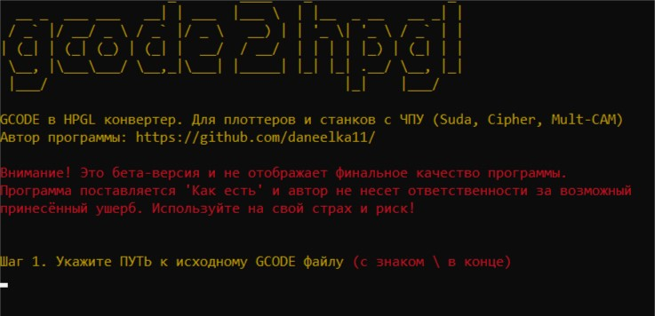

# gcode2hpgl
Программа для конвентирования G-CODE в HPGL (.plt)

При конвентировании учитываются только перемещения осей X, Y, Z 
Остальные параметры: скорость, сплайн устанавливаются на контроллере ЧПУ-Станка/Плоттера.

